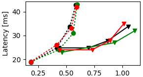
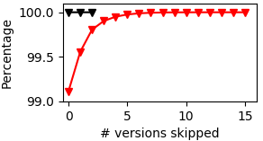

Python scripts based on MatPlotLib for plotting basho bench results for throughput and staleness, with output generated by [this set of scripts](https://github.com/SyncFree/basho_bench/tree/ec1/script/g5k)

## Usage
Both scripts support drag&drop from Finder


## Dependencies 
- Python 2
- MatPlotLib

## Throughput script

Colour codes included support up to three directories at once, but if you add some [here](./throughput.py#L175) you can plot more than 3.

```bash
 $ throughput.py [<dir1> <dir2> <dir3>]
```

Both 1 million and 10 million keyspace plotting is available for *MultiDC-Multiround*, *MultiDC-SingleRound*, *MultiDC-Exponential* and *SingleDC* scenarios.

### Changing keyspace and rounds
For *MultiDC-Multiround*, *MultiDC-SingleRound*, *SingleDC*, use the following line in [load_tput function](./throughput.py#L74)
```python
e['avg_tput']= float(((avg/3)/10)*((rounds*reads)+writes))/1000000
```
for *MultiDC-Exponential*, the following:
```python
e['avg_tput']= float(((avg/3)/10)*(1022+writes))/1000000
```

Various other settings are definable in the [```plot(workload)``` function](./throughput.py#L159-L244). Notably at [line 179](./throughput.py#L179) desired write ratios to plot can be defined.

```python
writes = [10, 100]
``` 
Means the script will only grab data with ```writes``` equal either ```10``` or ```100```.

### Tree structure

```bash
$ tree bench-2017-04-12-1492022929-ec/
bench-2017-04-12-1492022929-ec/
├── basho_bench_summary-1000000-10-100-10-1
│   ├── summary.csv
│   ├── summary.png
│   └── txn_latencies.csv
├── basho_bench_summary-1000000-10-100-10-10
│   ├── summary.csv
│   ├── summary.png
│   └── txn_latencies.csv
├── basho_bench_summary-1000000-10-100-10-15
│   ├── summary.csv
│   ├── summary.png
│   └── txn_latencies.csv
├── basho_bench_summary-1000000-10-100-10-20
│   ├── summary.csv
│   ├── summary.png
│   └── txn_latencies.csv
...
```
The scrip recovers a number of information from directory name. For example ```basho_bench_summary-11-22-33-44-55``` represents the following:

```
keyspace: 		11
rounds:			22
reads:			33
writes:			44
client_threads:		55
```
therefore directories names should follow the following naming scheme:
 ```basho_bench_summary-keyspace-rounds-reads-writes-client_threads```


Parsing structure is a key value dictionary

```python
workload = {
'type'    # Basho bench or staleness
'keys'    # 1m or 10m
'rounds'  # 10 usually
'reads'   # 100 usually 
'writes'  # one from [2, 10, 100]
'threads' # one from [1, 3, 5, 7, 10, 15, 20, 30, 40]
'f_tput'  # summary csv file
'f_lat'   # latency csv file
'tput_avg'# average throughput (calculated as average of 3 values)
'lat_avg' # average latency (calculated as average of 3 values)
}

```

Workload dictionary for plotting

```python
 wload_type = {
 'reads'   : # of reads per round
 'writes'  : # of writes per round
 'threads' : # of threads/clients
 }
```

### Output example
```
$ ./scripts/throughput.py multi-dc-exponential/bench-2017-04-16-1492332652-clocksi multi-dc-exponential/bench-2017-04-16-1492345917-physics
Treating multi-dc-exponential/bench-2017-04-16-1492332652-clocksi
Generating CAV for 10 writers
--> {'l_tp': [136.86066666666665, 0.007336], 'th': '1'}
--> {'l_tp': [138.983, 0.021728], 'th': '3'}
--> {'l_tp': [141.49233333333333, 0.035616], 'th': '5'}
--> {'l_tp': [144.588, 0.048776], 'th': '7'}
--> {'l_tp': [150.02533333333335, 0.067172], 'th': '10'}
--> {'l_tp': [158.66866666666667, 0.095312], 'th': '15'}
--> {'l_tp': [187.951, 0.10724], 'th': '20'}
--> {'l_tp': [234.65366666666665, 0.128632], 'th': '30'}
--> {'l_tp': [312.1923333333333, 0.128912], 'th': '40'}
Generating CAV for 100 writers
--> {'l_tp': [156.142, 0.02714], 'th': '1'}
--> {'l_tp': [162.75, 0.078234], 'th': '3'}
--> {'l_tp': [172.41366666666664, 0.1239], 'th': '5'}
--> {'l_tp': [181.39733333333334, 0.165672], 'th': '7'}
--> {'l_tp': [190.701, 0.225498], 'th': '10'}
Treating multi-dc-exponential/bench-2017-04-16-1492345917-physics
Generating CR for 10 writers
--> {'l_tp': [144.38833333333335, 0.006972], 'th': '1'}
--> {'l_tp': [147.02533333333335, 0.020552], 'th': '3'}
--> {'l_tp': [150.148, 0.033572], 'th': '5'}
--> {'l_tp': [151.911, 0.046424], 'th': '7'}
--> {'l_tp': [158.244, 0.063672], 'th': '10'}
--> {'l_tp': [164.83866666666665, 0.091588], 'th': '15'}
--> {'l_tp': [195.88466666666665, 0.102844], 'th': '20'}
--> {'l_tp': [244.13966666666667, 0.123704], 'th': '30'}
--> {'l_tp': [320.8496666666667, 0.125524], 'th': '40'}
Generating CR for 100 writers
--> {'l_tp': [163.28966666666665, 0.02596], 'th': '1'}
--> {'l_tp': [169.022, 0.075284], 'th': '3'}
--> {'l_tp': [174.21666666666667, 0.121776], 'th': '5'}
--> {'l_tp': [184.07, 0.162604], 'th': '7'}
--> {'l_tp': [197.449, 0.216884], 'th': '10'}
Plotting graph...
Showing interactive graph...
```





## Staleness script
Plots a [CDF](https://en.wikipedia.org/wiki/Cumulative_distribution_function) plot for version staleness. The example below illustrates that for ~99% of reads, the most recent version has been returned for the red curve.

### Tree structure
```bash
$ tree staleness-2017-04-12-1492030851-clocksi/
staleness-2017-04-12-1492030851-clocksi/
├── Stale-1000000-10-100-10-1.csv
├── Stale-1000000-10-100-10-10.csv
├── Stale-1000000-10-100-10-15.csv
├── Stale-1000000-10-100-10-20.csv
├── Stale-1000000-10-100-10-3.csv
├── Stale-1000000-10-100-10-30.csv
├── Stale-1000000-10-100-10-5.csv
├── Stale-1000000-10-100-10-7.csv
├── Stale-1000000-10-100-100-1.csv
├── Stale-1000000-10-100-100-10.csv
├── Stale-1000000-10-100-100-15.csv
├── Stale-1000000-10-100-100-3.csv
...

```
Files follow the same naming convention as for throughput directories, that is:
```Stale-keyspace-rounds-reads-writes-client_threads```

### Output example
```
$ ./scripts/staleness.py Stale-10000000-10-100-10-40.csv
Treating Stale-10000000-10-100-10-40.csv
> i: 61820075 sum 99.1138348909 ratio: 99.1138348909
> i:  276363 sum 99.5569174455 ratio: 0.443082554526
> i: 154702 sum 99.8049454281 ratio: 0.248027982582
> i: 60681 sum 99.9022330262 ratio: 0.0972875981632
> i: 29917 sum 99.9501978434 ratio: 0.0479648172286
> i: 15650 sum 99.9752889084 ratio: 0.0250910649339
> i: 8089 sum 99.9882577023 ratio: 0.0129687938818
> i: 3995 sum 99.9946627377 ratio: 0.00640503542562
> i: 1910 sum 99.9977249699 ratio: 0.00306223220599
> i: 853 sum 99.9990925532 ratio: 0.00136758328362
> i: 341 sum 99.9996392658 ratio: 0.00054671266086
> i: 139 sum 99.9998621194 ratio: 0.000222853547975
> i: 62 sum 99.9999615217 ratio: 9.94023019745e-05
> i: 16 sum 99.9999871739 ratio: 2.56522069612e-05
> i: 7 sum 99.9999983967 ratio: 1.12228405455e-05
> i: 1 sum 100.0 ratio: 1.60326293507e-06
xa [0, 1, 2, 3, 4, 5, 6, 7, 8, 9, 10, 11, 12, 13, 14, 15] y [99.11383489094871, 99.55691744547435, 99.80494542805606, 99.90223302621924, 99.95019784344782, 99.97528890838173, 99.98825770226354, 99.99466273768915, 99.99772496989515, 99.99909255317877, 99.99963926583963, 99.99986211938761, 99.99996152168958, 99.99998717389654, 99.99999839673708, 100.0000000000000]
Plotting
```



