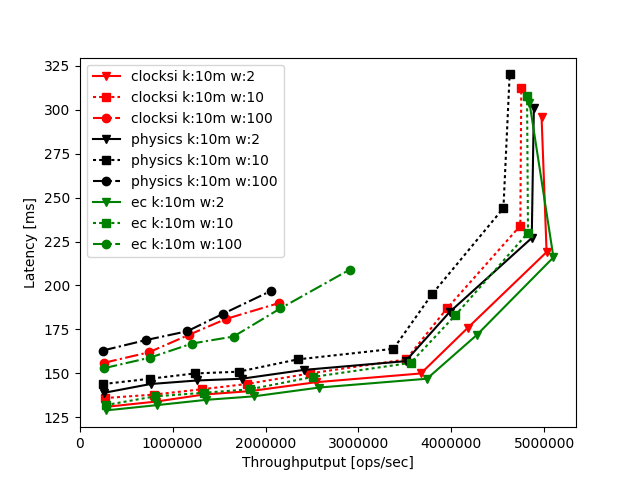

Python scripts based on MatPlotLib for plotting basho bench results for throughput and staleness.

## Examples



## Usage
Both scripts support drag&drop directories from Finder
```
 $ <script> [<dir1> <dir2> <dir3> ...]
```
## Throughput script
The script's directory (the command line arguments)  should be structured as such
Both 1million and 10 million keyspace plotting is available, as well as exponential, multidc multi- and single-round.

### Changing keyspace and rounds

```python
e['avg_tput']= float(((avg/3)/10)*((rounds*reads)+writes))/1000000 # MultiDC MultiRound
e['avg_tput']= float(((avg/3)/10)*(1022+writes))/1000000 # For exponential

```

```bash
 $ tree ../multi-dc-multiround/bench-2017-04-12-1492030851-clocksi/

../multi-dc-multiround/bench-2017-04-12-1492030851-clocksi/
|--basho_bench_summary-1000000-10-100-10-1
|   |-- summary.csv
|   |-- summary.png
|   |-- txn_latencies.csv
|-- basho_bench_summary-1000000-10-100-10-10
|   |-- summary.csv
|   |-- summary.png
|   |-- txn_latencies.csv
....
```
Parsing structure is a key value dictionary

```python
workload = {
'type'    # Basho bench or staleness
'keys'    # 1m or 10m
'rounds'  # 10 usually
'reads'   # 100 usually 'writes'  : one from [2, 10, 100]
'threads' # one from [1, 3, 5, 7, 10, 15, 20, 30, 40]
'f_tput'  # summary csv file
'f_lat'   # latency csv file
'tput_avg'# average throughput (calculated as average of 3 values)
'lat_avg' # average latency (calculated as average of 3 values)
}

```

Workload dictionary for plotting

```python
 wload_type = {
 'reads'   : # of reads per round
 'writes'  : # of writes per round
 'threads' : # of threads/clients
 }
```
General algo:

```
Foreach type in [Physics, ClockSI, EC]
  Foreach keyspace in [1m, 10m]  
    Foreach thread_nb in [1 3 5 7 10 15 20 30 40]  
      [(30s+40s+50s)/3]) against throughput
        1 graph
	 3 lines, one for each pair from [[100, 2], [100, 10], [100, 100]
```
## Staleness script
