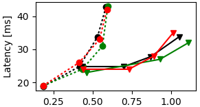

# What's here

This repo contains tools developed for [Antidote](https://github.com/SyncFree/antidote)

## [Plotter](./plotter/)
Python scripts for plotting [Basho Bench](https://github.com/SyncFree/basho_bench) results, both for *Staleness* and *Throughput*

## [Dump scripts](./tables_dump/)
Erlang scripts for dumping *cache* and *snapshot* tables into files

## [Parser](./parser/)
This implementation has been **abandoned** and the functionalities will be directly implemented into [Antidote](https://github.com/SyncFree/antidote) replication protocols. However, a lot of useful information about log structure and handling are present.